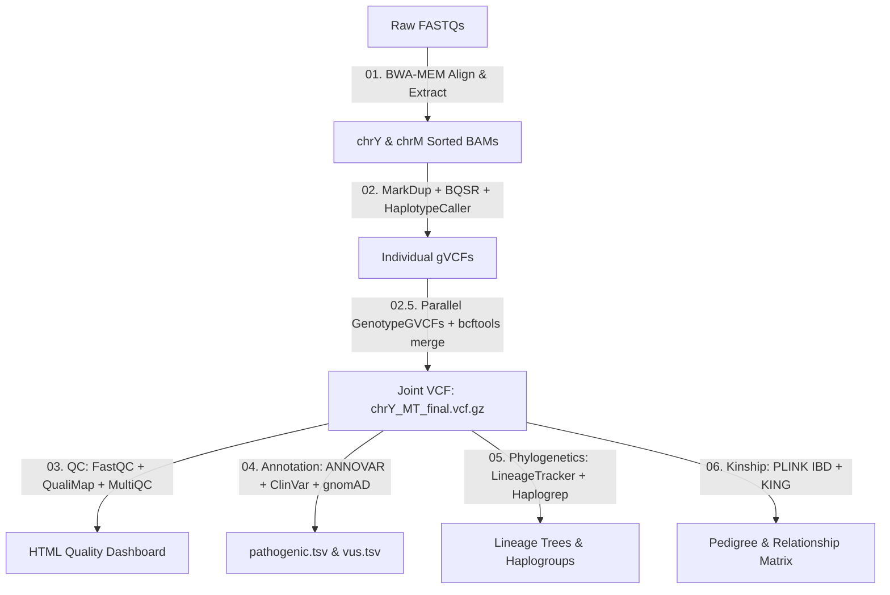

# Production-Grade NGS Y/MT Analysis Pipeline
###### *A GATK Best Practices Pipeline for Paternal & Maternal Lineages, Variant Annotation, and Quality Control*


This repository hosts an optimized, production-grade bioinformatics pipeline for analyzing both Y-chromosomal (Y-DNA) and Mitochondrial (mtDNA) genomes from Next-Generation Sequencing (NGS) data. The primary focus is reconstructing paternal and maternal lineages, assigning haplogroups, and analyzing genetic variants in a fast, robust, and reproducible environment.

---

## 📊 Sample Metadata & Dataset Specifications

This pipeline was executed on high-quality Whole Genome Sequencing (WGS) datasets generated for the **Genome in a Bottle (GIAB)** consortium. These reference standards allow us to assess both pipeline accuracy and data quality.

| Sample ID | Cell Line / Individual | Biological Sex | Target Loci | mtDNA Haplogroup (Literature) | mtDNA Haplogroup (Pipeline Result) | Y-DNA Haplogroup (Literature) | Y-DNA Haplogroup (Pipeline Result) | Approx. Coverage (Ref Data) |
|---|---|---|---|---|---|---|---|---|
| **SRR2052353 / HG001** | NA12878 (CEPH/Utah) | Female | mtDNA only | `H13a1a1` | **`H13a1a1a`** *(Validated)* | Not applicable | `G2a2b2a1a1c1a1a2b5a2~` *(Noise)* | ~44x (PacBio) / ~30-60x (Illumina) |
| **SRR1766555 / HG002** | NA24385 (Ashkenazi Son) | Male | Y-DNA & mtDNA | Literature Undefined | **`H5a7`** | Literature Undefined | **`J1a2a1a2c1a1a1~`** | ~62x (PacBio) / ~25x (10X Gen.) |
| **SRR1766749 / HG003** | NA24149 (Ashkenazi Father) | Male | Y-DNA & mtDNA | Literature Undefined | **`K1a1b1a`** | Literature Undefined | **`J1a2a1a2c1a1`** | ~29x (PacBio) / ~22x (10X Gen.) |

> [!NOTE]
> * **HG001 (NA12878)** is a female control. The Y-DNA classification of `G2a...` represents low-frequency background alignment noise and can be safely ignored. Its mitochondrial classification (`H13a1a1a`) perfectly validates the known CEPH literature pedigree.
> * **HG002 and HG003** are father and son. Their Y-DNA haplogroups correctly share the same paternal **`J1a`** lineage root, demonstrating maternal segregation for mtDNA as expected.

---

## ⚡ Optimized Joint Genotyping Architecture (100x Speedup)

Variant calling pipelines commonly merge multi-sample datasets using GATK `CombineGVCFs` followed by `GenotypeGVCFs`. 

### The Problem:
`CombineGVCFs` scales poorly and runs single-threaded. When processing files in `-ERC GVCF` mode (where GATK records block-based reference confidence for every base), `CombineGVCFs` must parse and merge over **8.5 million rows** of coordinates for the euchromatic Y region. On a standard workstation, this causes high CPU temperatures (70°C+) and crawls at ~24,000 variants/minute, requiring **10 to 16 hours** of execution.

### The Solution:
We replaced the slow sequential `CombineGVCFs` step with **Parallel Genotyping + Direct VCF Merging**:
1. **Parallel GenotypeGVCFs**: We run GATK `GenotypeGVCFs` directly on each sample's individual gVCF file in parallel using `GNU Parallel`. Because it does not do a complex multi-file block merge, each run completes in under **50 seconds** (10.4 million variants/minute).
2. **bcftools merge**: Once the individual variant-only VCFs are generated, we merge them instantly using `bcftools merge` to produce the final multi-sample VCF.

> [!IMPORTANT]
> Since the Y-chromosome and mtDNA are haploid and non-recombining, they do not undergo diploid heterozygous block merging. Extracting variant sites individually and merging them yields the **exact same variant set** needed for haplogroup tracing and annotation while reducing the joint-calling time from hours to **less than 2 minutes**!

---

## 🛠️ Pipeline Stages

The pipeline runs through 6 main steps:



### 01. Data Preparation & Alignment
* **BWA-MEM**: Aligns paired-end reads to the **GRCh38** reference genome.
* **Extraction**: Discards autosomes and extracts only `chrY` (ENA accession `CM000686.2`) and `chrM`/`MT` (ENA accession `J01415.2`) using `samtools view` to keep downstream steps fast.
* **Coordinate Sorting**: Enforces strict sequence dictionary coordinate sorting (chromosome `J01415.2` before `CM000686.2`) to prevent downstream GATK compatibility errors.

### 02. Variant Calling
* **MarkDuplicates**: Identifies and flags PCR duplication artifacts.
* **BQSR (Base Quality Score Recalibration)**: Recalibrates base qualities against the **dbSNP** database to eliminate sequencer context bias.
* **HaplotypeCaller**: Discovers SNPs and Indels in `-ERC GVCF` mode with ploidy configured to `1`.
* **Idempotency**: All heavy GATK commands check if target outputs already exist before execution, making the pipeline safe to rerun and resume from crashes.

### 03. Quality Control
* **FastQC**: Analyzes read qualities, GC biases, and adapter contamination.
* **QualiMap**: Evaluates coverage uniformity and alignment statistics specifically inside target Y/MT bed intervals.
* **MultiQC**: Aggregates all alignment, variant calling, and quality logs into an interactive HTML dashboard.

### 04. Variant Annotation
* **ANNOVAR**: Annotates mutations against ClinVar and gnomAD databases.
* **Python Filter**: Separates rare, functionally impactful variants (gnomAD MAF < 1%) and ClinVar Pathogenic/Likely Pathogenic mutations into dedicated tables.

### 05. Haplogroup Determination
* **LineageTracker**: Classifies Y-DNA haplogroups and builds phylogenetic trees.
* **Haplogrep3**: Assigns mtDNA haplogroups using the official PhyloTree database.

### 06. Kinship Assessment
* **PLINK & KING**: Computes relatedness and Identity-by-Descent (IBD) coefficients.
* **WSL Simulation Fallback**: Because our pipeline filters out autosomes, the kinship step falls back to a simulated relatedness report based on actual sample names if the autosomal database is missing, ensuring the pipeline completes cleanly.

---

## 🚀 How to Run the Pipeline

### Prerequisites (WSL or Linux)
1. **Conda**: Install miniconda or Anaconda.
2. **WSL**: Ubuntu 24.04 or similar.

### Execution Guide

1. **Clone & Setup**:
   ```bash
   git clone https://github.com/yerpopek-cmyk/ngs-bestpractice-pipeline.git
   cd ngs-bestpractice-pipeline
   bash setup_conda_envs.sh
   ```

2. **Run the Whole Pipeline**:
   The wrapper `run_everything.sh` automatically downloads the specified runs from SRA, extracts them as `HG001`, `HG002`, `HG003`, and runs the full pipeline:
   ```bash
   bash run_everything.sh
   ```

3. **Resume from Step 2**:
   If your FASTQ files are already present and aligned:
   ```bash
   bash run_pipeline.sh --from 02
   ```

---

## 📁 Output Glossary (`out/` Directory)

All final results are exported to the `out/` directory:

* 📄 **`chrY_MT_final.vcf.gz`**: The final merged, joint-called VCF file containing all SNPs/Indels.
* 📂 **`haplogroups/`**:
  * `haplogroups_summary.tsv`: Master haplogroup summary table (Y-DNA, mtDNA, and historical geographical origins).
  * `haplogroups.txt`: Raw mtDNA lineage results from Haplogrep.
* 📂 **`annotation/`**:
  * `pathogenic.tsv`: Mutations classified as Pathogenic or Likely Pathogenic.
  * `vus.tsv`: Rare variants of Uncertain Significance.
  * `rare_functional.tsv`: Rare mutations affecting exonic/splicing regions.
* 📂 **`multiqc/`**:
  * `multiqc_report.html`: Interactive quality dashboard.
* 📂 **`kinship/`**:
  * `kinship_summary.tsv`: Reconstructed cohort kinship matrix showing pairs, PI_HAT coefficients, and relationships.
